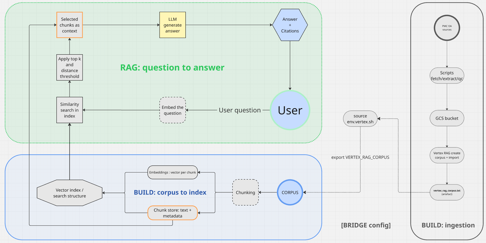

# RAG Demo Kit (Vertex AI) — Public Sample Corpus

> **« La mémoire n’est jamais une simple répétition, mais une refiguration. »**  
> *Paul Ricœur —* *La Mémoire, l’Histoire, l’Oubli* *(2000)*

> **A RAG is an utterance that only exists through its anchoring:**  
> a documentary memory → a retrieval protocol → a way to cite.  
> This chain is what gives it legitimacy.  
> Anchoring is what ties the words back to their source.


This repository is a public, sanitized demo kit designed to showcase the building blocks of a private RAG pipeline on **Google Cloud / Vertex AI**.

It deliberately keeps the core engineering concerns visible:
- **Traceability:** each run is recorded with its outputs and key metadata, making it easy to revisit and explain results later.
- **Evidence-first answers:** the system answers from identifiable texts and can point back to its sources.
- **Controlled retrieval:** we control how many passages are retrieved and how close they must be to the question.
- **Safe-by-default / public mode:** anything that could expose sensitive information is redacted, and the system stays in a “safe” mode by default.
- **Reproducibility:** someone else can rerun the project and obtain the same behavior, which makes validation and auditing easier.

This repo also reflects the project’s evolution:
- **L3opold (creative / poetry)** → early governance + “local-first” grounding
- **Toy/sample corpus** → reproducible public demo
- **Medical branch (PMC Open Access)** → real-world ingestion + chunking + QC gates (pre-embeddings)

> Medical disclaimer: this repository is **not medical advice** and **not for clinical use**.
> The medical track uses **open-access scientific articles** and contains **no patient records / no PHI**.

---

## Why this repo exists

This repository is a public, educational (intentionally limited) version of a private RAG project.  
The real/private corpus is not included for confidentiality and IP reasons.

Two complementary public tracks are provided:

1) **Public toy corpus** (`corpus/sample/`) to reproduce the core governance behavior:
- applying constraints: format, precedence and banned terms
- source-backed answers using **real file paths**
- deterministic “current > obsolete” precedence in conflicts

2) **Medical POC (PMC OA)** to demonstrate dataset preparation steps that matter in scientific contexts:
- extraction / chunking into `chunks.jsonl`
- **QC gates** and basic run logging before embeddings/indexing

Production concerns (security hardening, deployment, observability, compliance) are out of scope for this public demo.

---

## Contents

### Repository layout (tracked)

- `scripts/` — runnable entrypoints
  - `demo_playbook_local.py` — local-first grounding demo on the toy corpus (governance + citations)
  - `demo_playbook_gcs.py` — same demo, designed for GCS/Vertex workflows
  - `extract_chunks_from_oai.py` — medical track: parse PMC OA XML and write `chunks.jsonl`
  - `qc_chunks.py` — QC gate for chunks (integrity + size stats)
  - `sample_chunks.py` — manual sampling for quick human inspection
  - `playbook_core.py` — shared logic (prompting / formatting / citations)

- `corpus/sample/` — **toy corpus** used for the historical L3opold / governance experimentation  
  (format constraints, precedence rules, “current > obsolete”, source-backed answers)

- `docs/` — project documentation
  - `03-roadmap.md` — short roadmap (next steps)
  - `02_architecture.md` — architecture notes/diagrams
  - `00_project_context.md` — context and scope
  - `04-lab-notebook.md` — **lab notebook / journal de bord** (chronological index of runs)
  - `runbook/` — detailed run notes (validation checkpoints)

- `requirements.txt` — Python dependencies

### Generated locally (not tracked)

These folders are produced during runs and are typically gitignored:
- `artifacts/` — generated artifacts (e.g. `chunks.jsonl`)
- `outputs/` — run outputs/reports (e.g. `outputs/runs/<date>/qc_chunks.json`)
- `data/raw/`, `data/tmp/` — local corpora / intermediates


---

## Quickstart (Cloud Shell) - local-first grounding

### 0) Prerequisites
- Python 3
- A Google Cloud project with **Vertex AI enabled**
- Working **Application Default Credentials (ADC)**

### 1) Authenticate (ADC) — recommended isolated config
```bash
export CLOUDSDK_CONFIG="$HOME/.config/gcloud-demo"
gcloud auth application-default login --no-launch-browser
gcloud auth application-default set-quota-project <YOUR_PROJECT_ID>
export GOOGLE_APPLICATION_CREDENTIALS="$CLOUDSDK_CONFIG/application_default_credentials.json"
```

### 2) Run the demo (local-first)
```bash
export PROJECT_ID="<YOUR_PROJECT_ID>"
export REGION="europe-west1"
python3 -m scripts.demo_playbook_local
```

### 3) Example: version precedence (current vs obsolete)
```bash
export QUESTION="If current and obsolete logging policies conflict, which one should be followed and why? Cite sources."
python3 -m scripts.demo_playbook_local
```


# Medical POC (PMC OA) — chunking + QC gates (pre-embeddings)

## Reproduce medical OA corpus (PMC OAI-PMH) 

This repo can reproduce a small Open Access biomedical corpus from PubMed Central using **NCBI E-utilities** (ID discovery) and **PMC OAI-PMH** (XML harvesting).

## How it works

[](assets/L3opold_architecture.png)

- **Build (ingestion/indexing):** fetch PMC OA XML → chunk/QC → import/index
- **Bridge:** `vertex_rag_corpus.txt` → `env.vertex.sh` → `VERTEX_RAG_CORPUS`
- **Query-time:** embed question → retrieve (top_k + threshold) → answer + citations

### Step 1 — Fetch XML (OAI-PMH, `metadataPrefix=pmc`)

```bash
make fetch
```
> **Note (Makefile):** `make fetch` triggers the full download workflow (may take time and generate local data).
>
> For quick checks, prefer:
> - **Dry-run (prints the command only):** `make -n fetch`
> - **Small fetch (limit results):** `make fetch RETMAX=1` (or `RETMAX=5`)

> **Note (Data & reproducibility):**
> - Raw data is **gitignored** (`data/`).
> - For reproducibility, we commit only the **query** and a small **ID list sample** under `data_sample/`.
> - Downloads are **rate-limited**: the fetch script uses **sleep + retries** and writes rejected IDs to `data/tmp/rejected_aids.txt`.


### Focus

This track focuses on **data preparation** and **traceability** before embeddings/indexing.


## Short roadmap (public POC)

* [x] Local-first grounding on a public toy corpus (`corpus/sample/`)
* [x] Governance rules: strict output constraints + precedence + source-backed answers
* [x] Medical track: chunk extraction + QC gates + run logging (pre-embeddings)
* [x] Chunking standardization (optional refinements: tables, section-aware thresholds)
* [ ] **Embeddings + FAISS** (or managed vector store) + **top-k retrieval**
* [ ] Lightweight evaluation harness (queries + expected sources)
* [x] Minimal API/UI wrapper

---

### Step 2 — Extract chunks (PMC OA XML → JSONL)
```bash
python scripts/extract_chunks_from_oai.py
````

### Step 3 — Quick sanity checks

```bash
wc -l artifacts/chunks.jsonl
head -n 2 artifacts/chunks.jsonl
```

### Step 4 — Quality gates (recommended before embeddings)

```bash
python scripts/qc_chunks.py --input artifacts/chunks.jsonl --report outputs/runs/<DATE>/qc_chunks.json
python scripts/sample_chunks.py --n 10
```

**Expected outputs:**

* `artifacts/chunks.jsonl`
* `outputs/runs/<DATE>/qc_chunks.json`

### Run logging (traceability)

* `docs/lab-notebook.md` — chronological run log (index)
* `docs/run-notes/` — detailed notes per run (validation checkpoints)

---

### Makefile shortcuts

```bash
make fetch
make chunks
make qc RUN_DATE=2026-02-07
make sample
```

---

## Security hygiene (do not commit secrets)

Do not commit:

* API keys, tokens, service accounts (`*.json`)
* `.env` files
* private corpora or non-public documents

```
